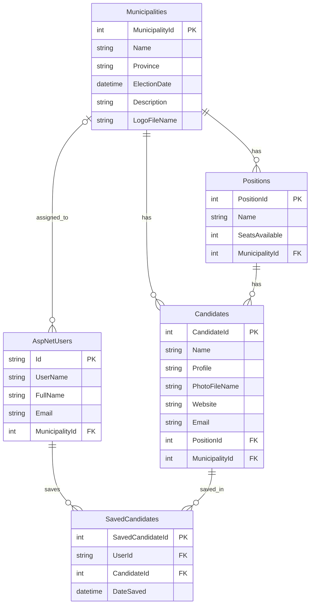

```mermaid
erDiagram
    Municipalities ||--o{ Positions : has
    Municipalities ||--o{ Candidates : has
    Positions ||--o{ Candidates : has
    Municipalities |o--o{ AspNetUsers : assigned_to
    AspNetUsers ||--o{ SavedCandidates : saves
    Candidates ||--o{ SavedCandidates : saved_in

    Municipalities {
        int MunicipalityId PK
        string Name
        string Province
        datetime ElectionDate
        string Description
        string LogoFileName
    }
    Positions {
        int PositionId PK
        string Name
        int SeatsAvailable
        int MunicipalityId FK
    }
    Candidates {
        int CandidateId PK
        string Name
        string Profile
        string PhotoFileName
        string Website
        string Email
        int PositionId FK
        int MunicipalityId FK
    }
    AspNetUsers {
        string Id PK
        string UserName
        string FullName
        string Email
        int MunicipalityId FK
    }
    SavedCandidates {
        int SavedCandidateId PK
        string UserId FK
        int CandidateId FK
        datetime DateSaved
    }
```
