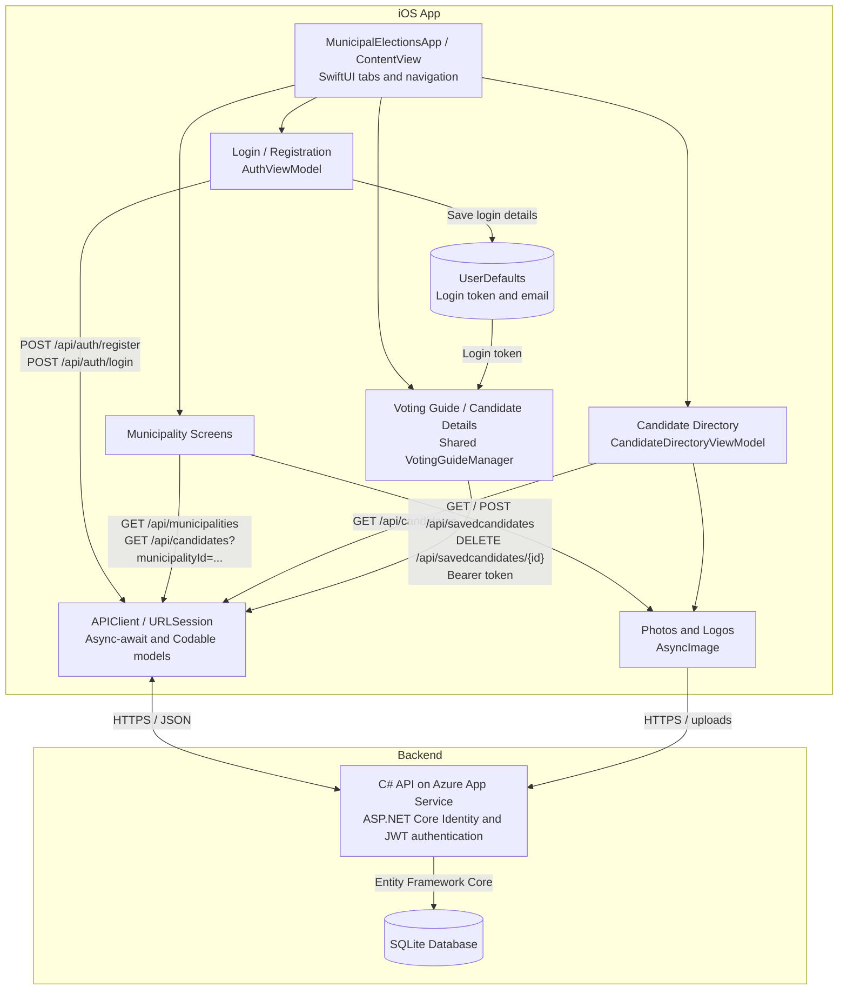

```mermaid
flowchart TD
    subgraph iOS["iOS App"]
        Tabs["MunicipalElectionsApp / ContentView<br/>SwiftUI tabs and navigation"]
        Auth["Login / Registration<br/>AuthViewModel"]
        Municipalities["Municipality Screens"]
        Directory["Candidate Directory<br/>CandidateDirectoryViewModel"]
        Guide["Voting Guide / Candidate Details<br/>Shared VotingGuideManager"]
        Defaults[("UserDefaults<br/>Login token and email")]
        Client["APIClient / URLSession<br/>Async-await and Codable models"]
        Images["Photos and Logos<br/>AsyncImage"]

        Tabs --> Auth
        Tabs --> Municipalities
        Tabs --> Directory
        Tabs --> Guide
        Auth -->|Save login details| Defaults
        Defaults -->|Login token| Guide
        Municipalities --> Images
        Directory --> Images

        Auth -->|"POST /api/auth/register<br/>POST /api/auth/login"| Client
        Municipalities -->|"GET /api/municipalities<br/>GET /api/candidates?municipalityId=..."| Client
        Directory -->|"GET /api/candidates"| Client
        Guide -->|"GET / POST /api/savedcandidates<br/>DELETE /api/savedcandidates/{id}<br/>Bearer token"| Client
    end

    subgraph Backend["Backend"]
        API["C# API on Azure App Service<br/>ASP.NET Core Identity and JWT authentication"]
        Database[("SQLite Database")]

        API -->|Entity Framework Core| Database
    end

    Client <-->|HTTPS / JSON| API
    Images -->|HTTPS / uploads| API
```
